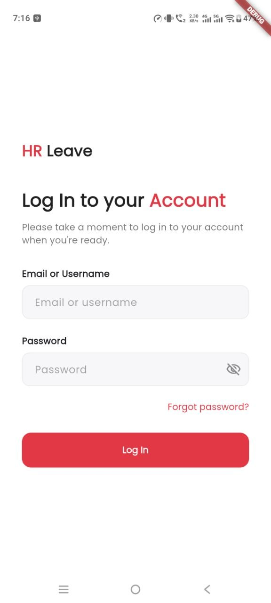
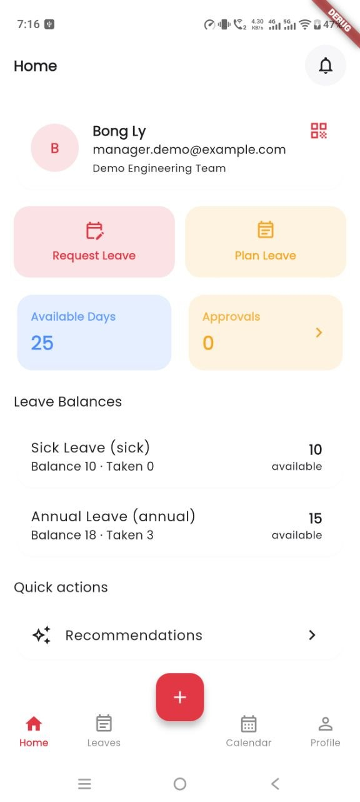
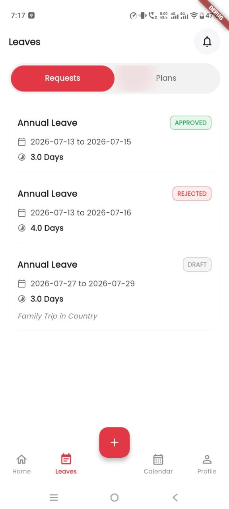
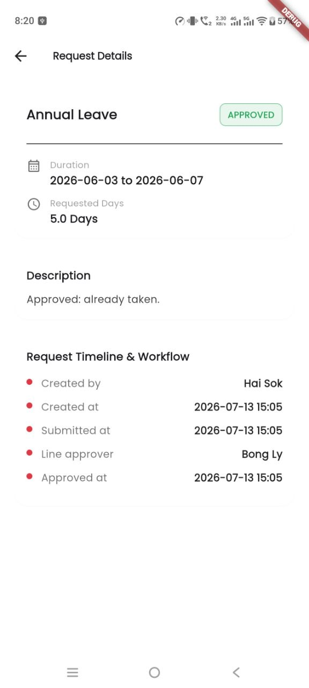
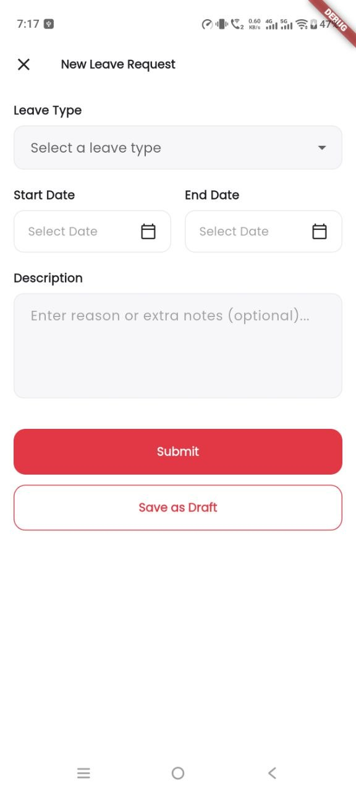
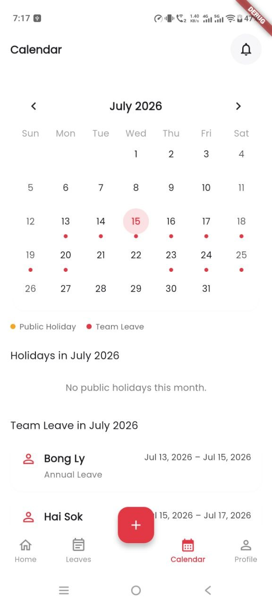
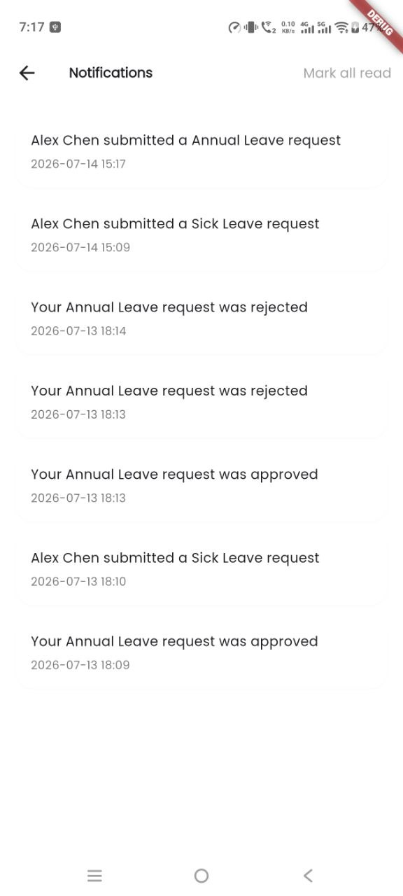
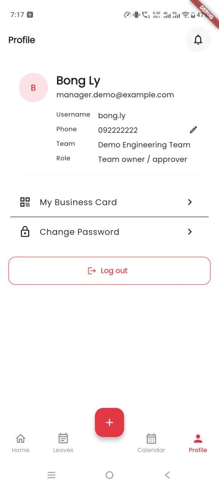

# HR Leave — Android Client

A native Android app for the HR Leave Management system, built for the "Android Application
Development" master's final exam project. It is a second, independent client (alongside a sibling
Flutter app) against the same existing FastAPI backend — this repo only consumes that API, it does
not implement or modify it.

## Overview & Objective

Leave requests, approvals, and team schedules are normally juggled over email/spreadsheets. This
app gives every employee a single mobile surface to submit and track leave, see their team's
schedule and public holidays, and get AI-assisted leave-date recommendations — while giving team
owners and superusers the management tools (approvals queue, master-data CRUD) they need without
a desktop session.

The app is role-adaptive from a single codebase and login flow:

- **Employee** (default): profile, leave balances, submit/track leave requests and leave plan
  requests, AI-recommended leave dates, team/holiday schedule, notifications.
- **Team owner / approver**: everything above, plus an approvals queue for their team's pending
  requests.
- **Superuser**: everything above, plus admin CRUD over users, teams, leave types, public holidays,
  and policies.

## Feature List

- **Authentication** — OAuth2 password-flow login, logout, forgot password, reset password. No
  refresh token endpoint exists on the backend; the 8-day access token is the session lifetime, and
  the app re-prompts login on a 401.
- **Dashboard** — role-adaptive home: profile card, Request Leave / Plan Leave action tiles,
  Available Days / Approvals stat row, leave balances, and a Recommendations entry point.
- **Leave Requests** — list, detail, create/submit, draft → submit → approve/reject lifecycle.
- **Leave Plan Requests** — same lifecycle as above, for multi-date leave plans.
- **AI Recommendations** — fetches suggested leave dates, lets the user select from them, and
  submits the result as a leave plan request.
- **Schedule** — month calendar showing public holidays and the caller's team's approved leave.
- **Approvals queue** (team owner) — approve/reject pending requests from their team.
- **Notifications** — in-app list with unread-count badge, polled while logged in; also posts a
  local system notification on new items, gated behind the runtime `POST_NOTIFICATIONS` permission
  (Android 13+) and degrading gracefully (badge-only) if denied.
- **Master Data admin** (superuser) — full CRUD + search + sort over Users, Teams, Leave Types,
  Public Holidays, Policies, and Leave Balances, through one reusable generic CRUD screen.
- **Profile** — view/edit own profile, change password.

## Architecture

**MVVM**, feature-by-package:

```
core/       cross-cutting: network (Retrofit/OkHttp), storage (encrypted token store),
            navigation, theme, error mapping, shared UI, notifications
data/       remote/api (Retrofit service interfaces), remote/dto, repository (one per
            backend resource — the only thing ViewModels talk to)
feature/    one package per screen area (auth, dashboard, leaverequests, leaveplanrequests,
            recommendations, approvals, schedule, notifications, admin/*, profile), each
            holding a ViewModel + UiState + Composable screen(s)
```

- Every screen has a `ViewModel` exposing a `StateFlow<UiState>`; Composables only read state and
  forward user actions — no business logic in Composables or in `MainActivity`, which is a single
  ~15-line Activity that just applies the theme and hosts the nav graph.
- Repositories are the only layer that calls the network layer, and always return a uniform
  `AppResult<T>` (`Success`/`Failure`) so every ViewModel handles loading/error state the same way.
- Dependency injection via Hilt (network clients, repositories, and Retrofit services are all
  provided, not constructed ad hoc).
- Networking via Retrofit + OkHttp, with kotlinx.serialization for JSON (not Gson/Moshi).
- Navigation via Navigation-Compose, single-Activity/single-NavHost.
- Secure local storage: the JWT access token lives in `EncryptedSharedPreferences`
  (`androidx.security:security-crypto`), never in plaintext prefs or source. No local database — the
  backend REST API is the app's data source of record, satisfying the "at least one advanced data
  source" requirement without a local cache.

### On RecyclerView

This app is built entirely in Jetpack Compose, which has no `RecyclerView`, `RecyclerView.Adapter`,
or `ViewHolder` — Compose's own recommended replacement for that pattern is a lazy list
(`LazyColumn`/`LazyRow`/`LazyVerticalGrid`) rendering keyed item composables. Every list in this app
(admin CRUD lists, leave request lists, notifications, schedule) is built this way. It is the same
underlying idea as RecyclerView — efficient, recycled rendering of a data list — expressed through
Compose's declarative primitives instead of the imperative View-system classes, and it is Google's
own documented migration path off RecyclerView, not a workaround.

## Tech Stack

Every version below is pinned in `gradle/libs.versions.toml` (a single version catalog — no
version numbers are scattered across `build.gradle.kts` files). Kept current as of this table's
last edit; bump the catalog entry and this row together.

| Library | Version | Why this one |
|---|---|---|
| Kotlin | 2.0.21 | Language + K2 compiler; required baseline for the Compose compiler plugin below |
| Android Gradle Plugin | 8.13.2 | Build tooling; tracks current stable Android Studio |
| Jetpack Compose BOM | 2024.12.01 | Single version pin for all `androidx.compose.*` artifacts — avoids hand-matching individual Compose module versions |
| Compose Compiler (`kotlin-compose` plugin) | matches Kotlin 2.0.21 | Kotlin 2.0+ moved the Compose compiler in-tree with Kotlin itself, replacing the old standalone `compose-compiler` version |
| Material 3 (`androidx.compose.material3`) | via Compose BOM | The design-system layer this app's UI is built on (STYLE_GUIDE.md is a customization of it, not a replacement) |
| Hilt | 2.52 | Dependency injection — constructor-injects ViewModels/repositories/Retrofit services instead of a hand-rolled service locator |
| KSP | 2.0.21-1.0.28 | Annotation processing for Hilt; used instead of kapt for faster builds and Kotlin-2.0 compatibility |
| Navigation-Compose | 2.8.4 | Type-unsafe but lightweight single-NavHost routing; matches this app's single-Activity architecture |
| Retrofit | 2.11.0 | HTTP client for the FastAPI backend — declarative `@GET`/`@POST` interfaces over hand-rolled `HttpURLConnection`/OkHttp calls |
| OkHttp | 4.12.0 | Transport + logging interceptor under Retrofit |
| kotlinx.serialization | 1.7.3 | JSON (de)serialization — chosen over Gson/Moshi for compile-time-checked, reflection-free serializers that pair natively with Kotlin data classes |
| kotlinx.coroutines | 1.9.0 | Structured concurrency for all suspend-based repository/ViewModel code |
| androidx.security-crypto | 1.1.0-alpha06 | `EncryptedSharedPreferences` for the JWT access token — the only thing persisted locally that must not sit in plaintext |
| ZXing core | 3.5.3 | QR code generation for the My Business Card screen |
| JUnit4 / MockK / kotlinx-coroutines-test | 4.13.2 / 1.13.13 / 1.9.0 | Unit testing + coroutine test dispatchers, and mocking without needing Mockito's reflection tricks on final Kotlin classes |

## UI Toolkit: Jetpack Compose vs. XML Views

This app's UI layer is **100% Jetpack Compose** — there are zero files under `res/layout/`, zero
`Activity`/`Fragment` classes that inflate a layout, and zero `findViewById`/`ViewBinding` usage.
`MainActivity` is a ~15-line `ComponentActivity` that calls `setContent { }` once and hosts the
entire app as composable functions from there.

The two approaches, and why this project picked Compose:

| | XML Views (traditional) | Jetpack Compose (this app) |
|---|---|---|
| UI definition | Declarative markup (`res/layout/*.xml`) + imperative Kotlin/Java to bind it (`findViewById`, `RecyclerView.Adapter`, `ViewHolder`) | Declarative Kotlin functions (`@Composable`) — the function's control flow *is* the UI logic |
| State → UI sync | Manual: mutate a `View` property yourself whenever data changes (`textView.text = ...`), easy to forget a spot and leave stale UI | Automatic: a composable re-executes (recomposes) when the `State`/`StateFlow` it reads changes; no manual view mutation calls |
| Lists | `RecyclerView` + `Adapter` + `ViewHolder` boilerplate for view recycling | `LazyColumn`/`LazyRow` — same recycling behavior, expressed as a function over a list, no adapter class (see "On RecyclerView" above) |
| Reuse | Custom `View` subclasses, or `<include>` layout composition | Plain function composition — a "component" is just a smaller `@Composable` called from a bigger one |
| Where used here | Only `AndroidManifest.xml` and resource XML that Android itself requires regardless of UI toolkit — `strings.xml`, `colors.xml` (base palette), `themes.xml` (splash-screen theme only, since Compose can't own the pre-Activity system splash) | Every screen, dialog, and reusable UI piece (`core/ui/*`, `core/admin/GenericCrudListScreen.kt`, etc.) |

The remaining XML in this repo (`res/values/strings.xml`, `colors.xml`, `AndroidManifest.xml`) isn't
"the old system used alongside Compose" — it's Android's resource/manifest format, which every
Android app uses irrespective of whether its UI is Views or Compose. There is no XML *layout*
anywhere in this app.

## Installation & Running

Prerequisites: Android Studio (latest stable), a running instance of the backend from
`../hr-leave-management/backend` (see that repo's README).

1. Clone this repository and open it in Android Studio.
2. Create `local.properties` in the project root (or add to the existing one) with the backend's
   base URL:
   ```
   API_BASE_URL=http://10.0.2.2:8000/api/v1
   ```
   `10.0.2.2` is the Android emulator's alias for the host machine's `localhost`; use the backend's
   actual LAN address instead if running on a physical device. If omitted, this value is the
   default fallback.
3. Sync Gradle, then build and run:
   ```
   ./gradlew assembleDebug
   ./gradlew installDebug   # with a device/emulator connected
   ```
4. Run unit tests / lint:
   ```
   ./gradlew testDebugUnitTest
   ./gradlew lint
   ```

## Screenshots

_These are the Flutter sibling app's screens (`ui/` folder) — the exact design reference this
Android client's UI was built and polished to match (see Phase 13/14 in `tasks/todo.md` and
`CONTRIBUTING.md`). They are not screenshots of this Android app itself; this app's own
screenshots are still to be added._

| Login | Home / Dashboard | Leave Requests |
|:---:|:---:|:---:|
|  |  |  |

| Request Detail | Leave Request Form | Schedule |
|:---:|:---:|:---:|
|  |  |  |

| Notifications | Profile |
|:---:|:---:|
|  |  |
